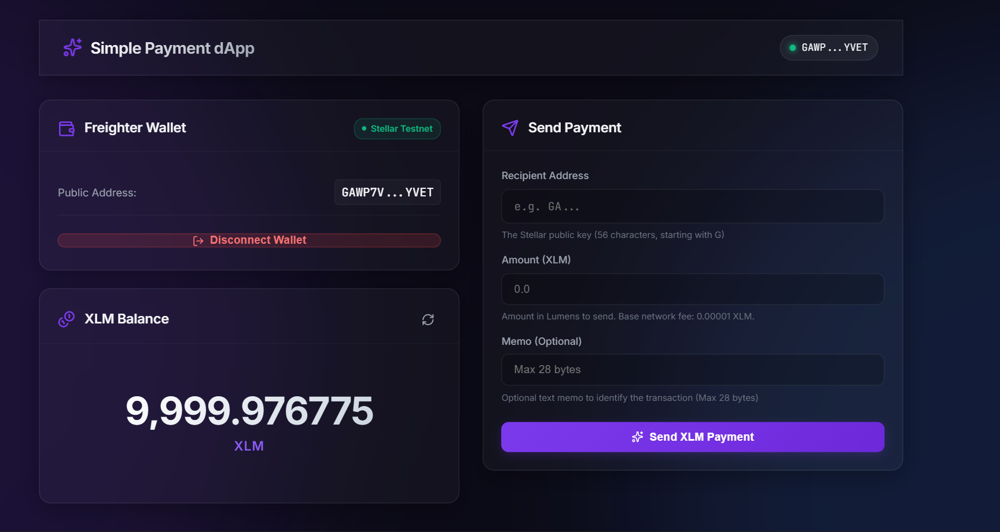
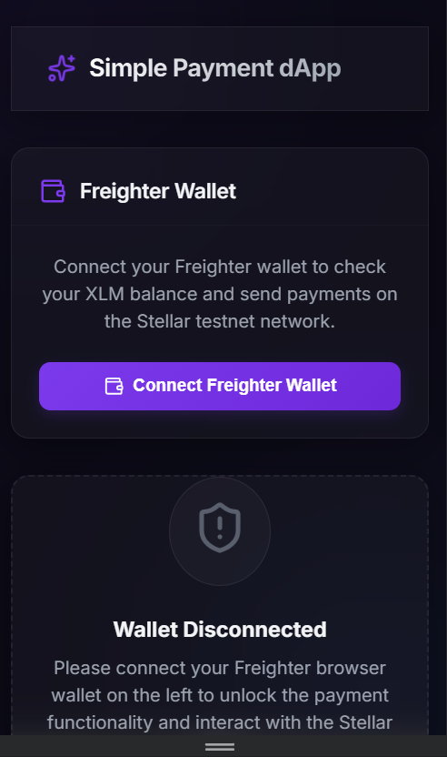
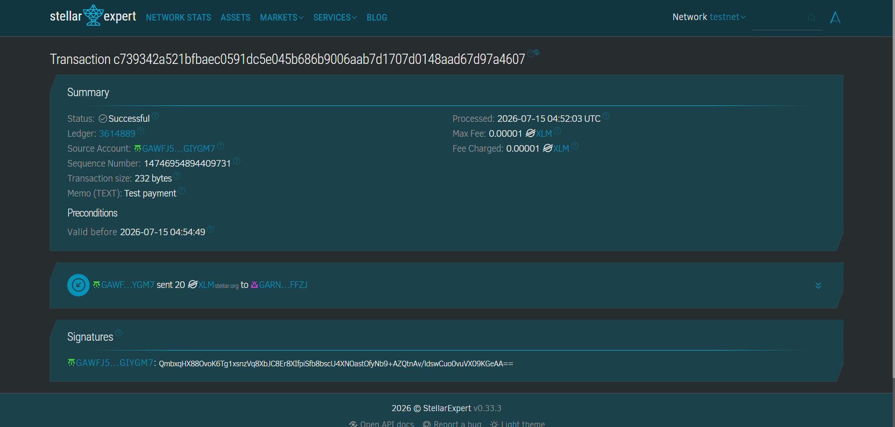
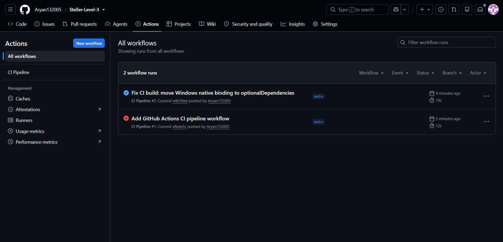

# Soroban Smart Contract Payment dApp (Stellar Testnet)

A sleek, responsive, and secure decentralized application (dApp) built on the Stellar Testnet. This application allows users to connect their Freighter wallet, check their XLM balance, automatically or manually fund their accounts using Stellar's Friendbot, and transfer XLM securely via a custom **Soroban Smart Contract** deployed on the testnet ledger.

🔗 **[Live Deployment Link](https://steller-level-3.vercel.app/)**  
🎥 **[Watch the Video Demo](https://drive.google.com/file/d/1KDLAQadsH0xVNYP8rf4wTu3SJYwCDHPn/view?usp=sharing)**

---

## 📜 Soroban Smart Contract Details

- **Contract ID**: `CA6G6PWT4CRBWSJFC5GNDFUPRMPHMKCFLOAPCC7JMB42ZY3YCMEMNLAK`
- **Native XLM Token SAC ID**: `CDLZFC3SYJYDZT7K67VZ75HPJVIEUVNIXF47ZG2FB2RMQQVU2HHGCYSC`
- **Contract Functions**:
  - `transfer(token_address: Address, from: Address, to: Address, amount: i128)`: Verifies sender's signature, executes native token transfer, increments transaction count, and tracks total volume.
  - `get_payment_count() -> u32`: Returns total number of payment transactions processed by the contract.
  - `get_total_volume() -> i128`: Returns total volume of XLM transferred via the contract (in stroops).

---

## 🌟 Features

- **Soroban Contract Payments**: Transfers XLM by invoking a custom smart contract on the ledger instead of a direct Horizon payment transaction. Includes authorization checks and transaction tracking.
- **On-chain Contract Statistics**: Queries and displays live contract state metrics (total payment count and total volume) directly in the user interface.
- **Wallet Connection Flow**: Seamless integration with the Freighter browser wallet. Shows active connection status, truncated public key, and includes manual network verification.
- **Wrong Network Alerts**: Automatically detects if the connected Freighter wallet is configured for a network other than the Stellar Testnet, displaying a clear alert to guide the user.
- **Account Balance Handling**: Retrieves real-time XLM balance via the Stellar Horizon Testnet API. Includes manual refresh and auto-refresh after successful transactions.
- **Friendbot Integration**: Identifies new (unfunded) testnet accounts and provides a direct, single-click "Fund Account" action that fetches 10,000 XLM from Friendbot, as well as portal links.
- **Robust Transfer Form**: Includes input validations (validates recipient's address checksum using the SDK's `StrKey`, validates amount limit against current balance plus transaction fee, and limits the optional memo to 28 bytes).
- **Transaction Overlay**: Interactive status modal for transactions, displaying pending/confirming loader, success confirmations (with links to the Stellar.expert block explorer), and clear network or wallet rejection details.
- **Glassmorphic Dark UI**: Premium layout designed with modern typography, smooth micro-animations, glowing background gradients, and complete desktop/mobile responsiveness.

---

## 🛠️ Tech Stack

- **Frontend Core**: React 19 + TypeScript + Vite 8
- **Smart Contract**: Rust + Soroban SDK 26
- **Stellar Libraries**:
  - `@stellar/stellar-sdk` (v16) for Horizon/Soroban RPC queries, transaction construction, simulation, and assembly.
  - `@stellar/freighter-api` (v6) for wallet connectivity and secure transaction signing.
- **Styling**: Vanilla CSS (Custom Glassmorphism and animations)
- **Icons**: `lucide-react`

---

## 🚀 Setup & Local Execution

Follow these steps to run the project locally on your machine:

### 1. Prerequisites
Ensure you have the following installed on your machine:
- [Node.js](https://nodejs.org) (v20+ recommended)
- [NPM](https://www.npmjs.com/) (installed automatically with Node.js)
- A browser with the [Freighter Wallet Extension](https://www.freighter.app/) installed.

### 2. Configure Freighter Wallet for Stellar Testnet
By default, Freighter might be connected to the Stellar Public network. To use this app, you must switch it to Testnet:
1. Open the **Freighter** wallet extension.
2. Click the gear icon (**Settings**) in the top-right corner.
3. Select **Network**.
4. Choose **Testnet** (or click **Add Network** and configure with Passphrase `Test SDN Network ; September 2015` and URL `https://horizon-testnet.stellar.org` if needed).

### 3. Build and Test the Soroban Contract
Before running the frontend, you can compile and verify the Soroban smart contract using:
```bash
cargo test
stellar contract build
```

### 4. Clone and Install Dependencies
Navigate to the project root directory and run the following command to download dependencies:
```bash
npm install
```

### 4. Run the Development Server
Launch the application locally in development mode:
```bash
npm run dev
```
Once the dev server starts, open your browser and navigate to the local address displayed (usually `http://localhost:5173`).

---

## 💸 Getting Testnet XLM (Friendbot)

Stellar accounts must be initialized with a minimum balance of 1 XLM before they are active. 
- If you connect a brand new wallet address, the dApp will detect that it is "Unfunded" and display a button: **"Fund 10,000 XLM with Friendbot"**.
- Click this button to fund your account directly. The dApp will fetch the funds and update your balance in real-time.
- You can also manually access the Friendbot interface here: [https://friendbot.stellar.org](https://friendbot.stellar.org/?addr=GA...) by appending your public address to get funded.

---

## 📸 Screenshots

Below are placeholders for visual walkthroughs of the dApp.

### Wallet Connect


### Mobile View


### Balance Displayed
*Placeholder for the XLM Balance card showing the active account balance with a refresh button, or the warning card prompting to fund with Friendbot.*

### Successful Testnet Transaction
*Placeholder showing the completed transaction loader, transition to Freighter prompt, and successful sign feedback.*

### Transaction Result Shown to User

*Placeholder of the success modal containing the transaction hash, clipboard copy action, and direct link to the Stellar.expert explorer.*

### CI/CD Pipeline Workflow

*Placeholder for the CI/CD pipeline status indicator showing the current build status (success or failure).*
